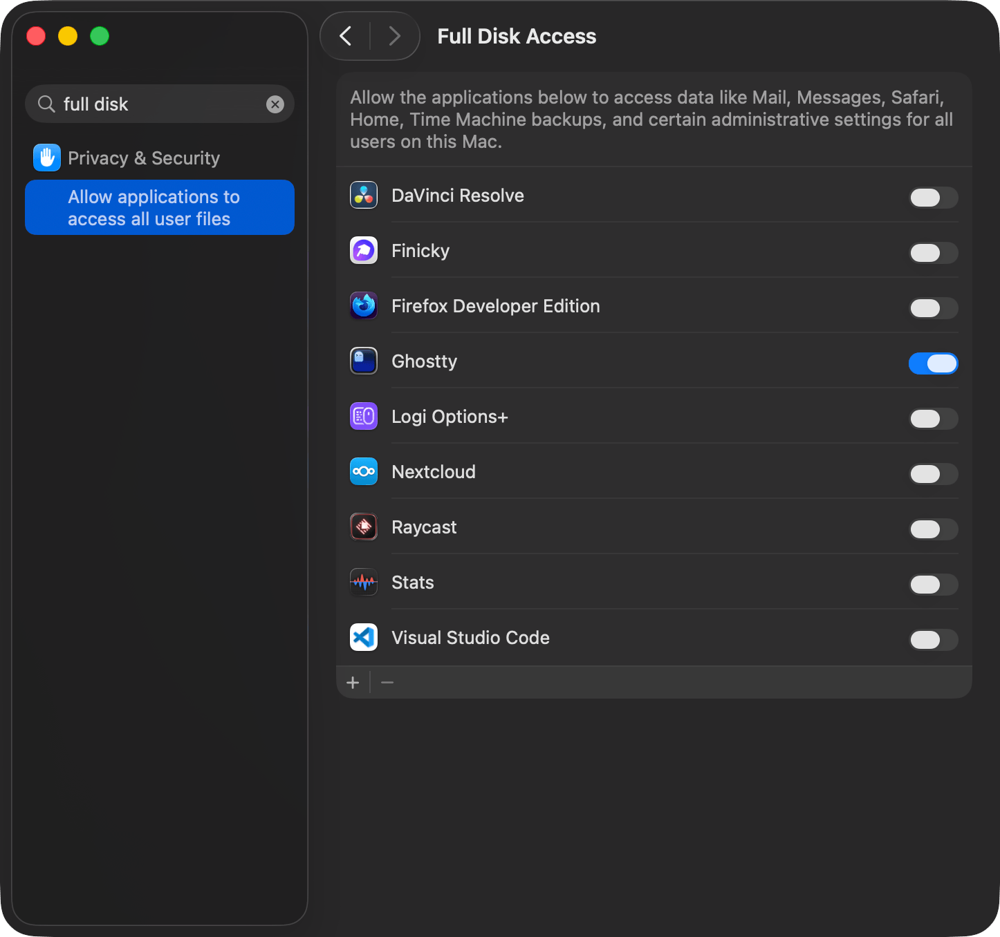

# 💻 Mac 馴服指南

當你剛抓到一隻野生的 MacBook 要怎麼讓他變成乖狗狗。

> 白話文：我重置 macOS 之後會裝的軟體清單，還有一些設定。

## 設定

首先先到 Display 調高螢幕解析度

> 快捷鍵 `Options` + `F1(☀)` 或是複製貼上網址：<a href="x-apple.systempreferences:com.apple.preference.displays">`x-apple.systempreferences:com.apple.preference.displays`</a>

剩下一個個來太慢了，直接下指令吧：

> 大多參考自：<https://macos-defaults.com>

### Dock

```bash
# Dock icon 大小
defaults write com.apple.dock "tilesize" -int "38"
# 自動隱藏 Dock
defaults write com.apple.dock "autohide" -bool "true"
# Dock 浮起時間（預設 0.5）
defaults write com.apple.dock "autohide-time-modifier" -float "0.5"
# Dock 浮起 Delay（預設 0.2）
defaults write com.apple.dock "autohide-delay" -float "0"
# 不要顯示最近開過的
defaults write com.apple.dock "show-recents" -bool "false"
# 重開 Dock 讓設定生效
killall Dock
```

### Finder

```bash
# 顯示所有檔案副檔名
defaults write NSGlobalDomain "AppleShowAllExtensions" -bool "true"
defaults write com.apple.finder "AppleShowAllFiles" -bool "true"
# 顯示隱藏檔案
defaults write com.apple.finder "AppleShowAllFiles" -bool "true"
# 顯示檔案路徑
defaults write com.apple.finder "ShowPathbar" -bool "true"
# 關閉副檔名警告
defaults write com.apple.finder "FXEnableExtensionChangeWarning" -bool "false"
# 下載檔案到本機
defaults write NSGlobalDomain "NSDocumentSaveNewDocumentsToCloud" -bool "false"
# 顯示 Title bar icons
defaults write com.apple.universalaccess "showWindowTitlebarIcons" -bool "true"
# 移除 Toolbar title rollover delay
defaults write NSGlobalDomain "NSToolbarTitleViewRolloverDelay" -float "0"
# 顯示 Status bar
defaults write com.apple.finder "ShowStatusBar" -bool "true"
# 重開 Finder 讓設定生效
killall Finder
```

### 滑鼠

```bash
# 滑鼠加速
defaults write NSGlobalDomain com.apple.mouse.scaling -float "2"
# 點擊力度輕
defaults write com.apple.AppleMultitouchTrackpad "FirstClickThreshold" -int "0"
```

### 鍵盤

```bash
# Fn 鍵當作功能鍵(預設就是 False)
defaults write NSGlobalDomain com.apple.keyboard.fnState -bool false
# 用 Tab 鍵切換控制項
defaults write NSGlobalDomain AppleKeyboardUIMode -int "2"
# 關閉雙空白句號
defaults write NSGlobalDomain NSAutomaticPeriodSubstitutionEnabled -bool false
```

### 其他

```bash
# 分組視窗
defaults write com.apple.dock "expose-group-apps" -bool "true" && killall Dock
# 關閉 Apple Intelligence
defaults write com.apple.CloudSubscriptionFeatures.optIn "545129924" -bool "false"
```

### 編輯內建快捷鍵

參見 [`com.apple.symbolichotkeys.plist`](./com.apple.symbolichotkeys.plist)

```bash
curl -L "https://raw.githubusercontent.com/elvisdragonmao/mac-init/refs/heads/main/com.apple.symbolichotkeys.plist" -o ~/Library/Preferences/com.apple.symbolichotkeys.plist && killall cfprefsd
```

## 軟體（指令安裝）

### Brew

```bash
/bin/bash -c "$(curl -fsSL https://raw.githubusercontent.com/Homebrew/install/HEAD/install.sh)"
```

```bash
# A-Z 排序
brew install ffmpeg # 影音轉檔工具
brew install git # 版本控制工具
brew install git-filter-repo # 重寫 Git 歷史
brew install gnupg # GPG 加密工具
brew install minio/stable/mc # MinIO 命令列工具
brew install nugget # iPhone 修補工具
brew install python3 # Python 執行環境
brew install thefuck # 指令更正工具
brew install tree # 顯示目錄結構
brew install vim # 終端文字編輯器
brew install yt-dlp # 網路影片下載工具

brew install --cask font-jetbrains-mono-nerd-font # 程式設計字型
brew install --cask ghostty # 終端機
brew install --cask vesktop # 第三方 Discord 用戶端
brew install --cask telegram # 即時通訊軟體
```

### Ghostty 設定

這裡可以打開鬼鬼來用囉！記得先給他 Full Disk Access 權限不然後面可能會卡指令。

網址：[`x-apple.systempreferences:com.apple.preference.security?Privacy_AllFiles`](x-apple.systempreferences:com.apple.preference.security?Privacy_AllFiles)



順便做一下設定：

```bash
mkdir -p '/Users/em/Library/Application Support/com.mitchellh.ghostty' && cat > '/Users/em/Library/Application Support/com.mitchellh.ghostty/config' <<'EOF'
quick-terminal-position = center
clipboard-write = allow
window-height = 20
window-width = 70
font-family = "FiraCode Nerd Font"

shell-integration-features = ssh-terminfo,ssh-env

background-opacity = 0.85
background-blur-radius = 16
theme = "TokyoNight"

clipboard-trim-trailing-spaces = true

auto-update = download
auto-update-channel = stable
EOF
```

### Oh My Zsh

```bash
sh -c "$(curl -fsSL https://raw.githubusercontent.com/ohmyzsh/ohmyzsh/master/tools/install.sh)"
git clone --depth=1 https://github.com/romkatv/powerlevel10k.git ${ZSH_CUSTOM:-$HOME/.oh-my-zsh/custom}/themes/powerlevel10k
git clone --depth=1 https://github.com/zsh-users/zsh-autosuggestions ${ZSH_CUSTOM:-~/.oh-my-zsh/custom}/plugins/zsh-autosuggestions
git clone --depth=1 https://github.com/zsh-users/zsh-syntax-highlighting.git ${ZSH_CUSTOM:-~/.oh-my-zsh/custom}/plugins/zsh-syntax-highlighting
```

### .zshrc

```bash
curl -L "https://raw.githubusercontent.com/elvisdragonmao/mac-init/refs/heads/main/.zshrc" -o ~/.zshrc
```

### Vim 設定

使用 Vim 8+ 內建套件管理器安裝 Catppuccin

```
git clone https://github.com/catppuccin/vim.git ~/.vim/pack/vendor/start/catppuccin
```

設定檔參見 [`vimrc`](./.vimrc)

```vim
curl -L "https://raw.githubusercontent.com/elvisdragonmao/mac-init/refs/heads/main/.vimrc" -o ~/.vimrc
```

### Node.js

```bash
# 下載並安裝 nvm：
curl -o- https://raw.githubusercontent.com/nvm-sh/nvm/v0.40.3/install.sh | bash

\. "$HOME/.nvm/nvm.sh" # 啟動
nvm install node # Node.js 執行環境
corepack enable pnpm # 啟用套件管理器代理
pnpm # JavaScript 套件管理器

pnpm i -g opencode # AI 助理 CLI
pnpm i -g prettier # 程式碼格式化工具
```

### Karabiner

設定檔參見 [`karabiner.json`](./karabiner.json)

```bash
curl -L "https://raw.githubusercontent.com/elvisdragonmao/mac-init/refs/heads/main/karabiner.json" -o ~/.config/karabiner/karabiner.json
```

## App Store

有些軟體不得不使用 macOS App Store 下載：

- [Bitwarden](https://apps.apple.com/tw/app/bitwarden/id1352778147?l=en-GB&mt=12) - 密碼管理器
- [LINE](https://apps.apple.com/tw/app/line/id539883307?l=en-GB&mt=12) - 即時通訊軟體
- [Keynote](https://apps.apple.com/tw/app/keynote-design-presentations/id361285480?l=en-GB) - 簡報製作工具
- [WireGuard](https://apps.apple.com/tw/app/wireguard/id1451685025?l=en-GB&mt=12) - VPN 用戶端

## 應用程式

> 除非特別標示 🌐 為官網，其他為最新版本直接下載網頁。通常是下載的檔案名稱是有版本號的所以變成要特別寫個 bash 去抓最新版本因此直接放官網連結。

### 瀏覽器

- [Chrome 🌐](https://www.google.com/intl/zh-TW/chrome/) - 填滿你空虛的記憶體
- [Firefox Developer Edition](https://download.mozilla.org/?product=firefox-devedition-latest-ssl&os=osx&lang=zh-TW) - 水狐狸
- [Firefox 🌐](https://www.firefox.com/zh-TW/thanks/) - 火狐狸
- [Finicky 🌐](https://github.com/johnste/finicky/releases) - 瀏覽器 Reverse Proxy
- [Tor Browser 🌐](https://www.torproject.org/download/) - 讓人想哭的洋蔥瀏覽器

#### 瀏覽器擴充功能

- Bitwatden: [Firefox](https://addons.mozilla.org/en-US/firefox/addon/bitwarden-password-manager/) | [Chrome](https://chromewebstore.google.com/detail/bitwarden-password-manage/nngceckbapebfimnlniiiahkandclblb)
- Neat Download Manager: [Firefox](https://addons.mozilla.org/en-US/firefox/addon/neatdownloadmanager-extension/) | [Chrome](https://chromewebstore.google.com/detail/neatdownloadmanager-exten/cpcifbdmkopohnnofedkjghjiclmhdah)
- Wappalyzer: [Firefox](https://addons.mozilla.org/en-US/firefox/addon/wappalyzer/) | [Chrome](https://chromewebstore.google.com/detail/wappalyzer-technology-pro/gppongmhjkpfnbhagpmjfkannfbllamg)
- Tampermonkey: [Firefox](https://addons.mozilla.org/en-US/firefox/addon/tampermonkey/) | [Chrome](https://chromewebstore.google.com/detail/tampermonkey/dhdgffkkebhmkfjojejmpbldmpobfkfo)
- [Url to QrCode](https://addons.mozilla.org/zh-TW/firefox/addon/url-to-qrcode/)

### 網路

- [Cloudflare WARP](https://1111-releases.cloudflareclient.com/mac/latest) - 免費加速 VPN
- [balenaEtcher](https://etcher.balena.io/#download-etcher) 🌐 - 開機碟燒錄工具
- [FortiClient](https://links.fortinet.com/forticlient/mac/vpnagent) - 學校公司 VPN
- [NeatDownloadManager](https://neatdownloadmanager.com/file/NeatDMInstaller.dmg) - 下載管理工具
- [Proxyman](https://proxyman.com/release/osx/Proxyman_latest.dmg) - HTTP 封包分析工具
- [Tailscale 🌐](https://pkgs.tailscale.com/stable/#macos) - 私有網路工具
- [VNC Viewer 🌐](https://www.realvnc.com/en/connect/download/viewer/) - 遠端桌面工具

### Office 全家桶

#### 開新版

> [延伸閱讀：【開源】快速免費啟用 Office 及 Windows | 毛哥EM 資訊密技](https://emtech.cc/p/massgrave)

#### 教育版

> 這裡以交大為例。每間學校的方案不同不一定有買 A3 桌面版 App。

- 請先確認你有交大提供的教育版 Microsoft 365 帳號。登入 [NYCU Portal](https://portal.nycu.edu.tw/#/) 後選擇 Microsoft 365 服務申請。
- 進入 [Office.com](https://www.office.com/) > 左下角應用程式 > 更多應用程式 > 右上角安裝應用程式 > Microsoft 365 應用程式 > [Office 應用程式與裝置](https://portal.office.com/account/) > 安裝 Office

### 數位創作

- [Creative Cloud](https://www.adobe.com/download/creative-cloud)（訂閱） - Adobe 應用程式管理工具
- [Blender](https://www.blender.org/download/) - 3D 建模與動畫工具
- [DaVinci Resolve 🌐](https://www.blackmagicdesign.com/products/davinciresolve) - 影片剪輯與調色工具
- [Figma](https://www.figma.com/download/desktop/mac) - 工程師設計工具

### 桌面工具

- [Alcove](https://tryalcove.com/download)（買斷） - 桌面整理工具
- [Liqoria](https://liqoria.com/download)（買斷） - 桌面增強工具
- [Stats](https://github.com/exelban/stats/releases/download/latest/Stats.dmg)（開源） - 系統監控工具
- [Raycast 🌐](https://www.raycast.com/) - 更好用的 Spotlight
- [Karabiner-Elements 🌐](https://karabiner-elements.pqrs.org/) - 鍵盤自訂工具

### 寫 Code

- [Visual Studio Code 🌐](https://code.visualstudio.com/thank-you?dv=osx) - 程式碼編輯器
- [Zed 🌐](https://zed.dev/download) - 程式碼編輯器
- [ChatGPT](https://persistent.oaistatic.com/sidekick/public/ChatGPT.dmg) - AI 助理
- [Arduino IDE 🌐](https://www.arduino.cc/en/software/) - Arduino 開發工具
- [Docker Desktop](https://desktop.docker.com/mac/main/arm64/Docker.dmg) - 容器化工具
- [JetBrains Toolbox](https://www.jetbrains.com/toolbox-app/download/download-thanks.html?platform=macM1) - JetBrains 工具管理器
- [Sublime Text](https://www.sublimetext.com/download_thanks?target=mac) - 輕量文字編輯器

### Self-hosted

- [AFFiNE](https://affine.pro/download) 🌐 - 筆記與協作工具
- [ente 🌐](https://ente.com/download/) - 相片備份工具
- [Nextcloud 🌐](https://nextcloud.com/install/#desktop-files) - 自架雲端平台

### 工具

- [OBS 🌐](https://obsproject.com/) - 錄影與直播工具
- [Keka](https://d.keka.io/) - 壓縮與解壓縮工具

### 社群軟體

- [Element](https://packages.element.io/desktop/install/macos/Element.dmg) - Matrix 用戶端

- _[Discord](https://discord.com/api/download?platform=osx) - 社群與語音軟體，剛才裝過 Vesktop 就不需要了_

### 驅動程式

- [EVO 🌐](https://arc.audient.com/) - 錄音介面驅動程式
- [Options+](https://download01.logi.com/web/ftp/pub/techsupport/optionsplus/logioptionsplus_installer.zip) - 羅技裝置設定工具

### 辦公

- [Notion](https://www.notion.com/desktop/mac-universal/download) - 筆記與協作工具
- [Parallels Desktop](https://www.parallels.com/products/desktop) - 虛擬機工具（訂閱）
- [Thunderbird 🌐](https://www.thunderbird.net/zh-TW/thunderbird/all/) - 電子郵件用戶端
- [Typora](https://downloads.typora.io/mac/) - Markdown 編輯器
- [Zotero](https://www.zotero.org/download/client/dl?channel=release&platform=mac) - 文獻管理工具

### 音樂

- [VLC 🌐](https://images.videolan.org/vlc/index.zh_TW.html) - 多媒體播放器
- [Spotify](https://download.scdn.co/SpotifyInstaller.zip) - 音樂串流服務

### 其他

- [SDR++](https://www.sdrpp.org/nightly) - 軟體無線電工具
